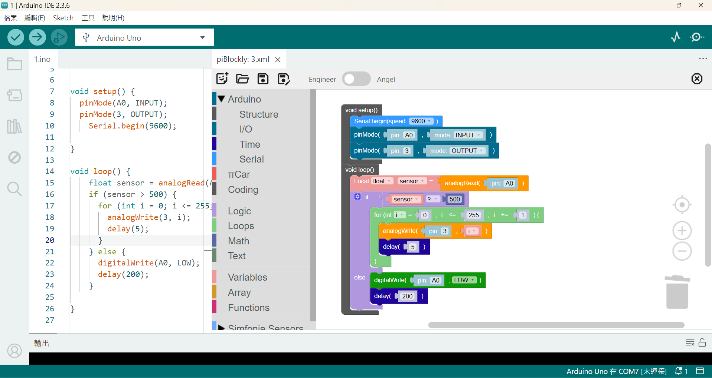
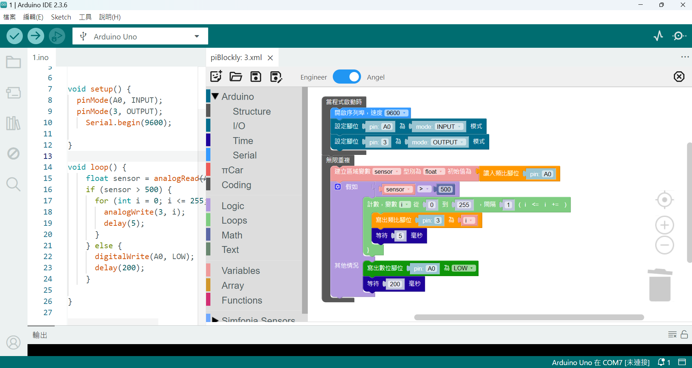

# πBlockly

[English](README_en.md) | [繁體中文](README.md)

## 適用於 Visual Studio Code / Arduino IDE 2 的 Blockly 延伸套件

πBlockly 是一個 Visual Studio Code extension，它將 Blockly（一個基於網頁的視覺化程式設計編輯器）直接整合到您的 Arduino 開發流程中，允許您使用直觀的拖放積木來編程您的 Arduino 開發板，這些積木隨後會被轉換為標準的 Arduino C++ 程式碼。

雖然這是一套 VS Code extension，但它也能在 Arduino IDE 2 中執行，利用其基於 VS Code 的核心提供統一的開發體驗，視覺化地生成您的 Arduino C++ 程式碼，然後利用 Arduino IDE 2 進行編譯、上傳和其他功能。

## 功能特色

-   **Blockly 視覺化編輯器：** 借助於 Blockly ，用於視覺化程式設計。
-   **兩套風格的積木 Engineer 與 Angel ：** Engineer 貼近 C++ 原汁原味的語法，讓剛進入 C++ 世界的新手有個平順的過渡期。 Angel 使用口語化的描述，但保留技術層面的語意，例如把 Arduino IO 腳位的 Read 與 Write 表達為讀入與寫出，明確指出訊號流動方向與原 API 設計的語彙。

    Engineer 風格範例：
    

    Angel 風格範例：
    
-   **Arduino C++ 程式碼生成：** 自動將 Blockly 積木轉換為簡潔且功能完善的 Arduino C++ 程式碼。
-   **彈性：** 除了不限特定開發板，還包含一組進階程式設計的積木 Coding，遇到沒有積木的情況，您完全可以即興發揮。當然，除錯得靠自己。
-   **自訂擴充積木：** πBlockly 支援高度客製化。您可以透過在 `media/user_modules` 目錄中建立自己的模組，來擴展積木庫。每個自訂模組都包含其獨特的積木定義、程式碼產生器、工具箱配置和多語言支援。
    *   詳情請參考文件：`doc/custum_module/create_custom_block_module_tutorial.md`。

## 安裝

**Arduino IDE 2 的安裝步驟（以 Windows 11 為例）：**

1.  關閉 Arduino IDE 2。
2.  **移除舊版本：**
    *   進入 `C:\Users\[user name]\.arduinoIDE\deployedPlugins` 並刪除所有 `piblockly-x.x.x` 資料夾。
    *   進入 `C:\Users\[user name]\.arduinoIDE\plugins`（如果此資料夾不存在，請建立它，注意 'plugins' 中的 's'）並刪除所有 `piblockly-x.x.x.vsix` 檔案。
3.  **下載最新的 `piblockly-x.x.x.vsix` 檔案。**
    *   將下載的 `.vsix` 檔案放入 `C:\Users\[user name]\.arduinoIDE\plugins`（如果此資料夾不存在，請建立它，注意 'plugins' 中的 's'）。
4.  啟動 Arduino IDE 2。您應該會在右上角看到一個粉紅色的 π 圖示。點擊它即可啟動 piBlockly 編輯器。

## 使用方式

1.  在 Arduino IDE 2 中打開一個 Arduino `.ino` 檔案。
2.  點擊編輯器右上角的「π」按鈕以啟動 piBlockly 編輯器。若無「π」按鈕，可按Shift + Ctrl + P 在命令面板輸入 piBlockly: Start piBlockly Editor 即可。
3.  選擇創建新專案或打開現有的 `.xml` Blockly 專案檔案。
4.  從工具箱中拖放積木以構建您的程式。
5.  生成的 Arduino C++ 程式碼將顯示在左側關聯的 `.ino` 編輯器中，此頁程式碼由 Arduino IDE 負責管理，πBlockly **不會**主動儲存 `.ino` 檔 。
6.  使用右方積木編輯區上方的工具列按鈕儲存您的 Blockly 專案（`.xml`）或關閉編輯器。

## 已知問題

-   復原功能受限於 Blockly 的事件記錄機制，一個動作可能需要多次復原步驟。
-   選取特定積木時，程式碼目前只能定位到其所在的函式開頭。若是全域區的積木，只能定位到程式碼的最前面，若全域定義的程式碼很多，將無法準確定位。
-   積木編輯區的標題頁籤有"X"可以關閉整個 πBlockly 面板，但不會檢查積木檔案是否有被修改而直接關閉，請小心使用。若想關閉 πBlockly 面板，建議使用工具列最右側的關閉按鈕。
-   πBlockly只在 Windows 11 + VS Code 1.105 + Arduino IDE 2.3.6 測試過，其它平台不保證是否正常執行。

## 靈感來源

-   Blockly: https://developers.google.com/blockly
-   TextBlockly: https://github.com/timcsy/TextBlockly
-   BlocklyDuino: https://github.com/BlocklyDuino/BlocklyDuino

## 許可證

此專案根據 [MIT 許可證](LICENSE) 授權。