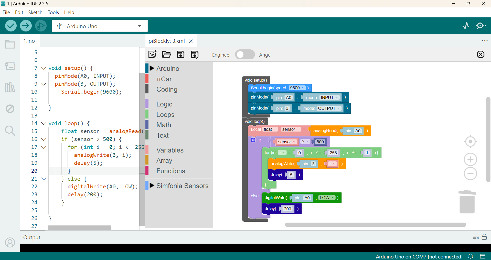
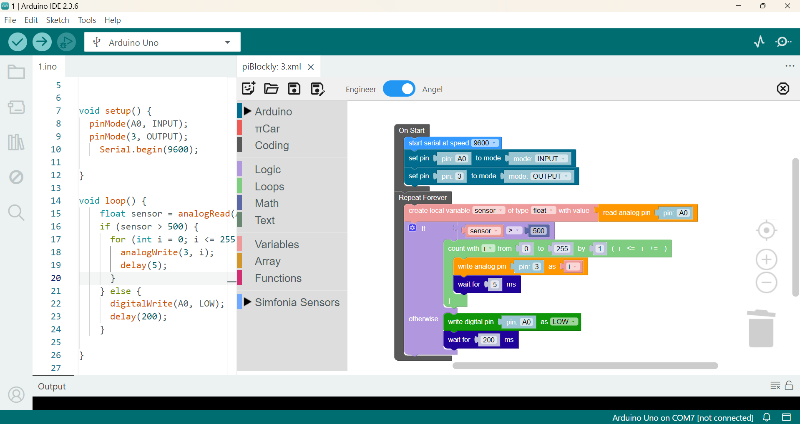

# πBlockly

[English](README_en.md) | [繁體中文](README.md)

## Blockly Extension for Visual Studio Code / Arduino IDE 2

πBlockly is a Visual Studio Code extension that integrates Blockly (a web-based visual programming editor) directly into your Arduino development workflow. It allows you to program your Arduino board using intuitive drag-and-drop blocks, which are then converted into standard Arduino C++ code.

Although this is a VS Code extension, it can also run within Arduino IDE 2, leveraging its VS Code-based core to provide a unified development experience. It visually generates your Arduino C++ code, which you can then use Arduino IDE 2 for compilation, uploading, and other functionalities.

## Features

-   **Blockly Visual Editor:** Powered by Blockly for visual programming.
-   **Two Block Styles: Engineer and Angel:** The Engineer style closely mirrors native C++ syntax, providing a smooth transition for newcomers to the C++ world. The Angel style uses more colloquial descriptions while retaining technical semantics. For example, Arduino I/O pin Read and Write are expressed as "read in" and "write out," clearly indicating signal flow direction and the original API design vocabulary.

    Engineer Style Example:
    

    Angel Style Example:
    
-   **Arduino C++ Code Generation:** Automatically converts Blockly blocks into clean and fully functional Arduino C++ code.
-   **Flexibility:** Not limited to specific development boards, it also includes a set of advanced programming blocks for "Coding." If you encounter situations without a specific block, you can improvise. Of course, debugging is up to you.
-   **Custom Extension Blocks:** πBlockly supports high customizability. You can extend the block library by creating your own modules in the `media/user_modules` directory. Each custom module includes its unique block definitions, code generators, toolbox configurations, and multilingual support.
    *   For details, please refer to the documentation: `doc/custum_module/create_custom_block_module_tutorial.md`.

## Installation

**Installation Steps for Arduino IDE 2 (Example: Windows 11):**

1.  Close Arduino IDE 2.
2.  **Remove Old Versions:**
    *   Go to `C:\Users\[user name]\.arduinoIDE\deployedPlugins` and delete all `piblockly-x.x.x` folders.
    *   Go to `C:\Users\[user name]\.arduinoIDE\plugins` (create this folder if it doesn't exist, note the 's' in 'plugins') and delete all `piblockly-x.x.x.vsix` files.
3.  **Download the latest `piblockly-x.x.x.vsix` file.**
    *   Place the downloaded `.vsix` file into `C:\Users\[user name]\.arduinoIDE\plugins` (create this folder if it doesn't exist, note the 's' in 'plugins').
4.  Launch Arduino IDE 2 (may require restarting twice). You should see a pink  icon in the top right corner. Click it to start the piBlockly editor.

## Usage

1.  Open an Arduino `.ino` file in Arduino IDE 2.
2.  Click the "" button in the top right corner of the editor to launch the piBlockly editor. If the "" button is not present, press Shift + Ctrl + P and type `piBlockly: Start piBlockly Editor` in the command palette.
3.  Choose to create a new project or open an existing `.xml` Blockly project file.
4.  Drag and drop blocks from the toolbox to build your program.
5.  The generated Arduino C++ code will be displayed in the associated `.ino` editor on the left. This code page is managed by Arduino IDE, and πBlockly **will not** actively save the `.ino` file.
6.  Use the toolbar buttons above the block editing area on the right to save your Blockly project (`.xml`) or close the editor.

## Known Issues

-   Undo functionality is limited by Blockly's event logging mechanism; one action may require multiple undo steps.
-   When selecting a specific block, the code can currently only navigate to the beginning of its containing function. For blocks in the global scope, it can only navigate to the very beginning of the code. If there is a lot of globally defined code, precise positioning will not be possible.
-   The block editing area's title tab has an "X" that can close the entire πBlockly panel. However, it does not check if the block file has been modified before closing directly. Please use with caution. It is recommended to use the close button  on the far right of the toolbar to close the πBlockly panel.
-   πBlockly has only been tested on Windows 11 + VS Code 1.105 + Arduino IDE 2.3.6. Normal operation on other platforms is not guaranteed.

## Inspiration

-   Blockly: https://developers.google.com/blockly
-   TextBlockly: https://github.com/timcsy/TextBlockly
-   BlocklyDuino: https://github.com/BlocklyDuino/BlocklyDuino

## License

This project is licensed under the [MIT License](LICENSE).